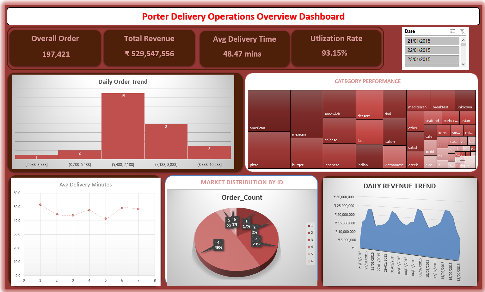

# Porter-Delivery-Analytics

   

## **Overview**

This project analyzes **Porter Delivery**'s declining customer satisfaction in key markets. By examining delivery data, I aim to pinpoint the root causes of delayed deliveries and provide data-driven recommendations to improve service times and customer experience, helping the company regain its competitive edge.

<!---->

## **Dataset**

The analysis uses the operational data of Porter Delivery. It is contained within a single Excel workbook that has three linked tables.

`Link for Dataset is` [porter-delivery-time-estimation](https://www.kaggle.com/datasets/ranitsarkar01/porter-delivery-time-estimation)

**1. Orders (`Orders` Sheet)**  
This is the main table with all delivery order details. Key columns include:  
*   **Logistics:** `Ship Date`, `Ship Mode` (e.g., Same Day, First Class).  
*   **Customer & Location:** `Customer ID/Name`, `Segment`, `City`, `State`, `Region`.  
*   **Product Details:** `Product ID`, `Category`, `Sub-Category`, `Product Name`.  
*   **Financials:** `Sales`, `Quantity`, `Discount`, `Profit`.  

**2. Returns (`Returns` Sheet)**  
This table tracks order returns. It is an important indicator of customer dissatisfaction.  
*   **Core Columns:** `Order ID` (which matches the `Orders` table) and `Returned` (Yes/No flag).  

**3. People (`People` Sheet)**  
This is a basic lookup table for regional managers.  
*   **Core Columns:** `Person` (Manager Name) and `Region`.  

By joining these tables (for example, linking `Order ID` and `Region`), the analysis can explore the relationship between delivery performance (`Ship Mode`, timeliness), customer profiles, product categories, and return rates to find reasons for declining satisfaction.

## Analysis

> Solution File for Analytics is `Porter - Solution.xlsx`

To diagnose the decline in Porter Delivery's satisfaction, I carried out a two-phase analysis on the order data.

**Phase 1: Data Preparation and Quality Check**  
*   **Cleaning:** I addressed missing values in key fields like `actual_delivery_time`, `store_primary_category`, and partner metrics (`total_onshift_partners`).  
*   **Transformation:** I changed `created_at` and `actual_delivery_time` from text to proper **datetime format** to allow for time-based analysis.  
*   **Feature Engineering:** I created new metrics, including **delivery duration**, and extracted **order hour** and **day of the week** for further analysis.

**Phase 2: Exploratory and Diagnostic Analysis**  
*   **Operational Bottlenecks:** I identified **peak order hours** and **high-volume days of the week** to assess stress on delivery networks.  
*   **Performance Analysis:** I calculated the **percentage of orders delivered within 30 minutes** and looked at the **distribution of delivery times**, finding significant outliers.  
*   **Root Cause Investigation:**  
    *   I compared **average delivery times across different store categories** and identified the **top 5 stores with the longest delays**.  
    *   I analyzed the **correlation between order volumes and the number of busy delivery partners** to evaluate resource use.  
    *   I looked into the **impact of the day of the week on average delivery time** to find recurring weekly bottlenecks.

This analysis highlighted critical issues in the delivery system, from specific slow stores and categories to understaffed peak times, providing a clear plan for targeted operational improvements.

## **Dashboard Summary**

This dashboard offers an overview of Porter Delivery's main performance metrics.

**Key Performance Indicators (KPIs):**
*   **Scale:** **197,421 total orders** processed, generating **¥52.95 Crores in revenue**.
*   **Efficiency:** The average delivery time is **48.47 minutes**, a key measure for customer satisfaction.
*   **Resource Utilization:** The delivery partner **Utilization Rate** is high at **93.15%**, showing nearly full operations.

**Core Visualizations:**
*   **Daily Order Trend:** A line chart shows the daily volume of orders, helping to spot increases, decreases, and overall demand patterns over time.
*   **Performance Over Time:** This likely includes a visual tracking the relationship between order volume and key metrics like average delivery time. It highlights changes in performance under different loads.
*   **Date Filter:** A slicer for **Date** lets users analyze performance for specific days or date ranges.

This dashboard centralizes key data, allowing management to monitor operational health, link busy days with delivery delays, and make informed choices to improve the delivery network.

## **How to Use the Dashboard**

This interactive dashboard is made for easy monitoring of delivery operations and performance.

1. **Open the File:** Start by launching the `Porter - Solution.xlsx` file in Microsoft Excel.

2. **Navigate & Interact:**
   * **Review KPIs:** First, take a look at the main performance metrics at the top: **Total Orders, Revenue, Average Delivery Time, and Utilization Rate.**
   * **Apply Time Filters:** Use the **Date slicer** to choose a specific day or range. This will update all charts and KPIs to show performance for that period.
   * **Analyze Trends:** Look at the **Daily Order Trend** line chart. Hover over data points to see exact order counts for specific dates and notice patterns like weekly peaks.

3. **Refresh Data (If Applicable):**
   * If the workbook is linked to a live operations database, update the dashboard by going to the **Data** tab and clicking **"Refresh All."**
   * **Security Note:** If asked to enable macros or external content, choose "Enable" only if you are sure about the file's source and security.

## Author & Contact
- Name: `Kshitij Saini`
   / [LinkedIn](https://www.linkedin.com/in/kshitij-saini-b950b7299?utm_source=share_via&utm_content=profile&utm_medium=member_android)
